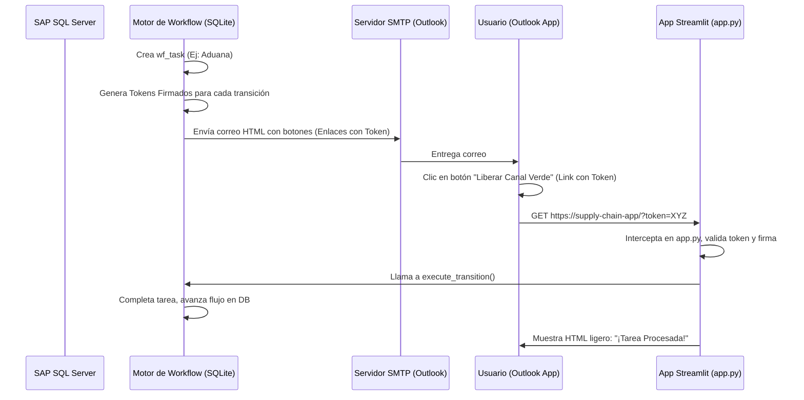

# Análisis Técnico: Aprobación de Tareas del Workflow vía Correo Electrónico (Outlook)

El objetivo es permitir que los usuarios responsables de ejecutar tareas del workflow puedan completarlas directamente haciendo clic en botones o enlaces en un correo electrónico enviado a su bandeja de Outlook, sin necesidad de ingresar manualmente al portal Streamlit.

---

## 1. Alternativas de Implementación

### Estrategia A: Enlaces Seguros (Deep Links) y Webhook (Recomendada)
Cuando una tarea requiere acción, el sistema genera correos con botones HTML. Cada botón es un enlace único que contiene un token criptográfico firmado que encapsula: `task_id`, `transition_id` y `user_id`.

* **Flujo**:
  1. El usuario hace clic en "Aprobar" en el correo.
  2. Su navegador abre el enlace: `https://supply-chain-app/?token=BASE64_HMAC_TOKEN&action=execute`.
  3. La aplicación Streamlit recibe la petición, valida la firma del token, ejecuta la transición en base de datos y le muestra un mensaje de éxito.
* **Ventajas**:
  - Determinista y 100% confiable.
  - No requiere credenciales de lectura de buzón.
  - Implementación simple aprovechando `st.query_params` en `app.py`.

### Estrategia B: Lectura de Respuestas por Correo (IMAP Polling / Graph API)
El correo enviado instruye al usuario a responder al remitente escribiendo palabras clave en el cuerpo del mensaje (ej. `[APROBAR]` o `[RECHAZAR]`) manteniendo el asunto original que contiene el ID de tarea (`[WF-TASK-129]`).

* **Flujo**:
  1. El usuario responde al correo.
  2. Un script en segundo plano se conecta vía IMAP o Microsoft Graph API al buzón del sistema cada 5 minutos.
  3. Lee los correos nuevos, busca el patrón `[WF-TASK-ID]`, parsea la primera línea del cuerpo y ejecuta la acción en base de datos.
* **Desventajas**:
  - Muy propenso a fallas por formateo de clientes de correo (firmas, hilos anteriores, caracteres especiales).
  - Complejidad en la gestión de credenciales y polling asíncrono.
  - Retraso en la ejecución debido al intervalo del cron de lectura.

---

## 2. Arquitectura de la Solución (Estrategia A)



---

## 3. Detalles de Codificación Propuestos

### A. Generación y Validación del Token (Sin dependencias externas pesadas)
Usaremos la librería nativa de Python `hmac` y `hashlib` combinada con codificación `base64` para firmar y verificar tokens sin requerir librerías JWT externas, asegurando portabilidad.

```python
import hmac
import hashlib
import base64
import json
import time

SECRET_KEY = b"supply_chain_super_secret_key" # Configurable en secrets.toml

def generate_task_token(task_id: int, transition_id: int, user_id: int, ttl_hours: int = 48) -> str:
    expiration = int(time.time()) + (ttl_hours * 3600)
    payload = {
        "task_id": task_id,
        "transition_id": transition_id,
        "user_id": user_id,
        "exp": expiration
    }
    # Serialize and encode payload
    payload_json = json.dumps(payload).encode('utf-8')
    payload_b64 = base64.urlsafe_b64encode(payload_json).decode('utf-8')
    
    # Generate signature
    signature = hmac.new(SECRET_KEY, payload_json, hashlib.sha256).digest()
    signature_b64 = base64.urlsafe_b64encode(signature).decode('utf-8')
    
    return f"{payload_b64}.{signature_b64}"

def verify_task_token(token: str) -> dict:
    try:
        payload_b64, signature_b64 = token.split('.')
        payload_json = base64.urlsafe_b64decode(payload_b64.encode('utf-8'))
        
        # Verify signature
        expected_sig = hmac.new(SECRET_KEY, payload_json, hashlib.sha256).digest()
        expected_sig_b64 = base64.urlsafe_b64encode(expected_sig).decode('utf-8')
        
        if not hmac.compare_digest(signature_b64, expected_sig_b64):
            return None # Signature mismatch
            
        payload = json.loads(payload_json.decode('utf-8'))
        
        # Verify expiration
        if time.time() > payload["exp"]:
            return None # Token expired
            
        return payload
    except Exception:
        return None
```

### B. Envío de Correo HTML (SMTP Outlook)
Al crear la tarea en `engine.py`, llamamos a un módulo de correos que formatea un HTML premium con los enlaces correspondientes:

```python
import smtplib
from email.mime.multipart import MIMEMultipart
from email.mime.text import MIMEText

def send_task_notification_email(user_email: str, task_name: str, instance_title: str, transitions: list, task_id: int, user_id: int):
    # Setup connection (using configurations from secrets.toml)
    smtp_server = "smtp.office365.com"  # Outlook SMTP
    port = 587
    sender_email = "notificaciones@tuempresa.com"
    
    msg = MIMEMultipart('alternative')
    msg['Subject'] = f"⚙️ ACCIÓN REQUERIDA: Tarea '{task_name}' en {instance_title}"
    msg['From'] = sender_email
    msg['To'] = user_email
    
    # Generate buttons HTML
    buttons_html = ""
    base_url = "http://localhost:8501" # Cambiar por URL pública de producción
    
    for trans in transitions:
        token = generate_task_token(task_id, trans.id, user_id)
        action_url = f"{base_url}/?token={token}"
        buttons_html += f"""
        <a href="{action_url}" style="display:inline-block; padding:10px 20px; font-family:sans-serif; font-size:14px; font-weight:bold; color:white; background-color:#3b82f6; text-decoration:none; border-radius:5px; margin-right:10px; margin-bottom:10px;">
            {trans.action_name}
        </a>
        """
        
    html_content = f"""
    <html>
      <body style="font-family: Arial, sans-serif; color: #334155; line-height: 1.6;">
        <div style="max-width: 600px; margin: 0 auto; padding: 20px; border: 1px solid #e2e8f0; border-radius: 8px;">
          <h2 style="color: #0f172a; margin-top: 0;">Asignación de Tarea Operacional</h2>
          <p>Se ha generado una nueva tarea en el flujo de <b>{instance_title}</b> que requiere tu aprobación o comentario.</p>
          <hr style="border: 0; border-top: 1px solid #e2e8f0; margin: 20px 0;">
          <p><b>Detalles de la Tarea:</b></p>
          <ul style="padding-left: 20px;">
            <li><b>Etapa Actual:</b> {task_name}</li>
            <li><b>Fecha de Asignación:</b> {datetime.now().strftime('%Y-%m-%d %H:%M')}</li>
          </ul>
          <p>Selecciona una de las siguientes opciones para procesar directamente la tarea desde tu correo electrónico:</p>
          <div style="margin-top: 20px; margin-bottom: 20px;">
            {buttons_html}
          </div>
          <p style="font-size: 0.8rem; color: #64748b;">Este enlace es seguro, de uso único y expirará en 48 horas.</p>
        </div>
      </body>
    </html>
    """
    
    msg.attach(MIMEText(html_content, 'html'))
    
    # Send execution (simulated or real SMTP send)
    # with smtplib.SMTP(smtp_server, port) as server:
    #     server.starttls()
    #     server.login(sender_email, "password_or_token")
    #     server.sendmail(sender_email, user_email, msg.as_string())
```

### C. Interceptación Webhook en Streamlit (`app.py`)
En el archivo principal `app.py`, colocamos la lógica de intercepción antes de cargar el Login o cualquier página normal de la sesión:

```python
# Intercept token requests from email deep links
if "token" in st.query_params:
    token = st.query_params["token"]
    
    # Verify token validity
    payload = verify_task_token(token)
    
    if not payload:
        st.error("❌ Enlace no válido, expirado o firma corrupta. Por favor, ingresa al portal de forma manual para resolver la tarea.")
        st.stop()
        
    # Process transition
    with get_db() as db:
        try:
            # Check if task is still pending to avoid double click conflicts
            task = db.query(WorkflowTask).filter(
                WorkflowTask.id == payload["task_id"], 
                WorkflowTask.status == 'PENDING'
            ).first()
            
            if not task:
                st.warning("⚠️ Esta tarea ya ha sido procesada o no se encuentra pendiente.")
            else:
                WorkflowEngine.execute_transition(
                    db=db,
                    instance_id=task.instance_id,
                    transition_id=payload["transition_id"],
                    user_id=payload["user_id"],
                    comment_text="Completado directamente vía correo electrónico (Outlook)."
                )
                st.balloons()
                st.success(f"🎉 ¡Tarea procesada con éxito! La importación/item ha avanzado en el flujo operacional.")
                
        except Exception as ex:
            st.error(f"Error procesando la transición: {str(ex)}")
            
    # Stop rendering the login/standard portal UI
    st.stop()
```

---

## 4. Impacto en el Proyecto Actual

1. **Simplicidad de Infraestructura**: No requiere configurar servidores adicionales (FastAPI o Node.js). La misma app de Streamlit procesa el webhook a través de `st.query_params`.
2. **Seguridad**: Los tokens están firmados con HMAC usando un secreto del servidor. Es imposible que un usuario falsifique una aprobación o altere el ID de la tarea.
3. **Escalabilidad de la Bandeja**: Reduce drásticamente el tráfico en el portal, ya que los aprobadores de alto nivel (Gerencia, Compras) solo entran a la web para reportes y auditoría, resolviendo el día a día desde Outlook.
